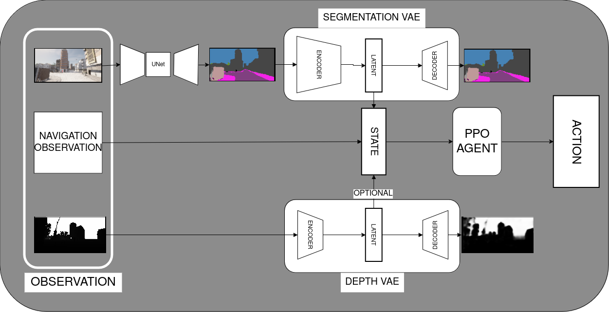

# Carla DRL

Carla DRL is a project that uses Deep Reinforcement Learning (DRL) to train an agent to drive a car in the Carla simulator.

## Project structure
```
Carla-DRL/
├── .gitignore                  # Specifies files and directories to be ignored by Git.
├── .coveragerc                 # Configuration for coverage.py, specifying files to omit from coverage reports.
├── .mypy.ini                   # Configuration for mypy, ignoring missing imports for certain libraries.
├── .pylintrc                   # Configuration for Pylint, checking the quality of Python code.
├── pyproject.toml              # Configuration for Poetry, managing dependencies and project metadata.
├── pytest.ini                  # Configuration for pytest, specifying test paths and options.
├── README.md                   # Main documentation file providing an overview and instructions.
├── measure_speed.py            # Script for measuring the speed of the agent in the simulation.
├── tests/                      # Testing functions to carla_drl package
├── carla_drl/                  # Main package directory for the Carla DRL project.
│   ├── __init__.py             # Marks the directory as a Python package.
│   ├── autoencoder/            # Contains files related to depth estimation tasks.
│   │   ├── __init__.py         # Marks the directory as a Python package.
│   │   ├── dataset.py          # Dataset class for loading autoencoder data.
│   │   ├── model.py            # Implements the Variational AutoEncoder model for image reconstruction.
│   │   ├── train.py            # Training logic for the vae model.
│   ├── depth_estimation/       # Contains files related to depth estimation tasks.
│   │   ├── __init__.py         # Marks the directory as a Python package.
│   │   ├── dataset.py          # Dataset class for loading depth estimation data.
│   │   ├── midas.py            # Implements the MonoDepthNet model for monocular depth estimation.
│   │   ├── train.py            # Training logic for the depth estimation model.
│   │   └── utils.py            # Utility functions for depth estimation tasks.
│   ├── lane_following/         # Contains files related to lane following tasks.
│   │   ├── agent.py            # Implements the agent for lane following.
│   │   ├── encoder.py          # Contains the encoder for processing inputs.
│   │   ├── model.py            # Defines the model architecture for lane following.
│   │   ├── parameters.py       # Configuration parameters for the lane following model.
│   │   └── train.py            # Training logic for the lane following model.
│   └── semantic_segmentation/  # Contains files related to semantic segmentation tasks.
│       ├── __init__.py         # Marks the directory as a Python package.
│       ├── dataset.py          # Dataset class for loading semantic segmentation data.
│       ├── train.py            # Training logic for the semantic segmentation model.
│       ├── unet.py             # Implements the UNet model for semantic segmentation.
│       └── utils.py            # Utility functions for semantic segmentation tasks.
├── simulation/                 # Contains files related to the simulation environment.
│   ├── __init__.py             # Marks the directory as a Python package.
│   ├── connection.py           # Manages the connection to the Carla simulator.
│   ├── environment.py          # Defines the environment for the simulation, including vehicle and pedestrian management.
│   ├── sensors.py              # Contains the camera sensor configuration and management for the simulation.
│   ├── settings.py             # Configuration parameters for the simulation.
│   └── sync_data_generation.py # Script for generating synchronized data from the Carla simulator.
└── .github/                    # Contains GitHub Actions workflows for CI/CD.
    └── workflows/              # Directory for workflow files.
        └── python-tests.yml    # Defines the workflow for running Python tests on push and pull request events.
```

## About the Project
This project develops an autonomous driving agent using reinforcement learning in the CARLA simulator. The agent will rely on visual features: predicted semantic maps and depth maps from sensor. These features, combined with vehicle data like velocity and steering, will serve as input for training a Proximal Policy Optimization (PPO) agent. The goal is to improve the agent's decision-making and navigation by leveraging enhanced visual understanding of the environment.

## Installation
The CARLA simulator needs to be installed. We are using [CARLA-0.9.14](https://github.com/carla-simulator/carla/releases/tag/0.9.14/).  
Optionally, create virtual environment:
```
conda create -n carla_drl python=3.7.12 -y
conda activate carla_drl
```
Set appropriate torch version and cuda compatability in pyproject.toml acording to your system.
Then install all dependencies using poetry:
```
pip install poetry
poetry install
```
## Usage

To generate data for training semantic segmentation and depth estimation models, run:
```
python simulation/sync_data_generation.py
```
You can modify the code to collect data for your cases (town, weather, route, etc.)

To train UNet for semantic segmentation task, run:
```
python carla_drl/semantic_segmentation/train.py py
```

To train MiDaS for depth estimation task, run:
```
python carla_drl/depth_estimation/train.py py
```

To train VAE for semantic segmentation masks, run:
```
python carla_drl/autoencoder/train.py 
```
and for depth maps, run:
```
python carla_drl/autoencoder/train.py --is_depth --log_dir results/autoencoder-depth/
```

To train PPO agent, set constant settings such as paths to models in ```carla_drl/lane_following/parameters.py``` and run:
```
python carla_drl/lane_following/train.py 
```

To test PPO agent, run:
```
python carla_drl/lane_following/train.py --train False --checkpoint-path path/to/checkpoint_dir
```

All training scripts uses tensorboard for logging. You can see training progress by running:
```
tensorboard --logdir results/...
```

## Results
<p align="center"> </p>
<p align="center">Third person view of car</p>
<div>
</div>
<p align="center"> </p>
<p align="center">First person view what model sees</p>

### Pipeline

### Pretrained weights
In this [link](https://drive.google.com/drive/folders/1W5mWDP-pCIErUsxOv-t-RM6a8BTmoX4c?usp=drive_link) you can find pretrained UNet, VAEs for semantic and depths maps and PPO agent weights.
## Authors
Dhzavid Sadreddinov, Pavel Volkov, Diana Vostrova, Alsu Khairullina